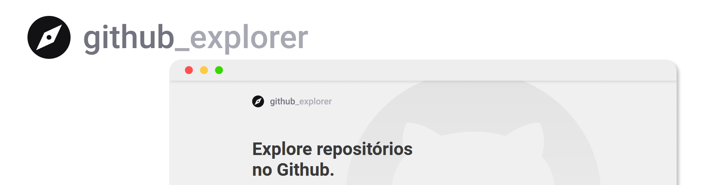
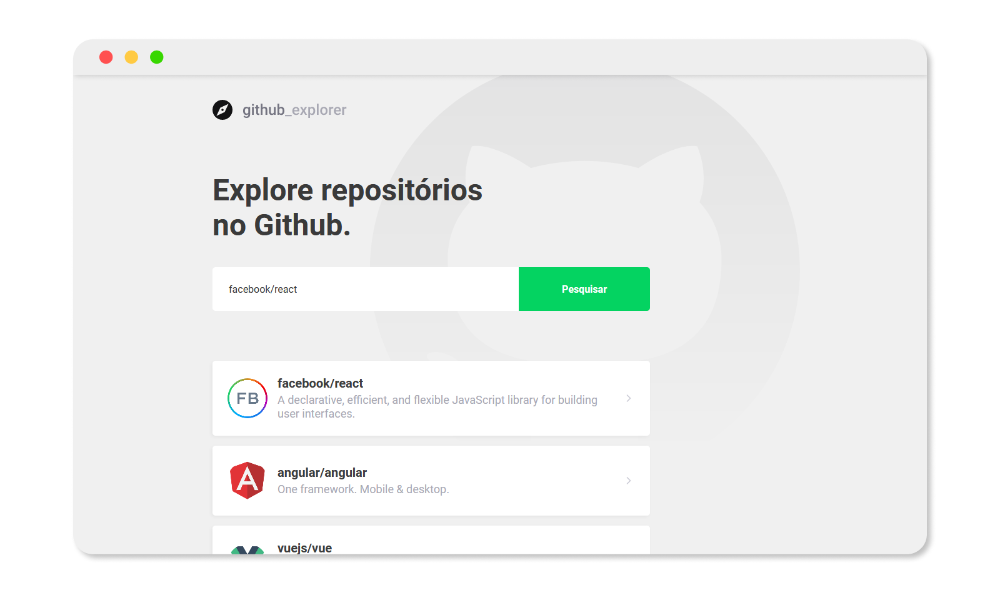
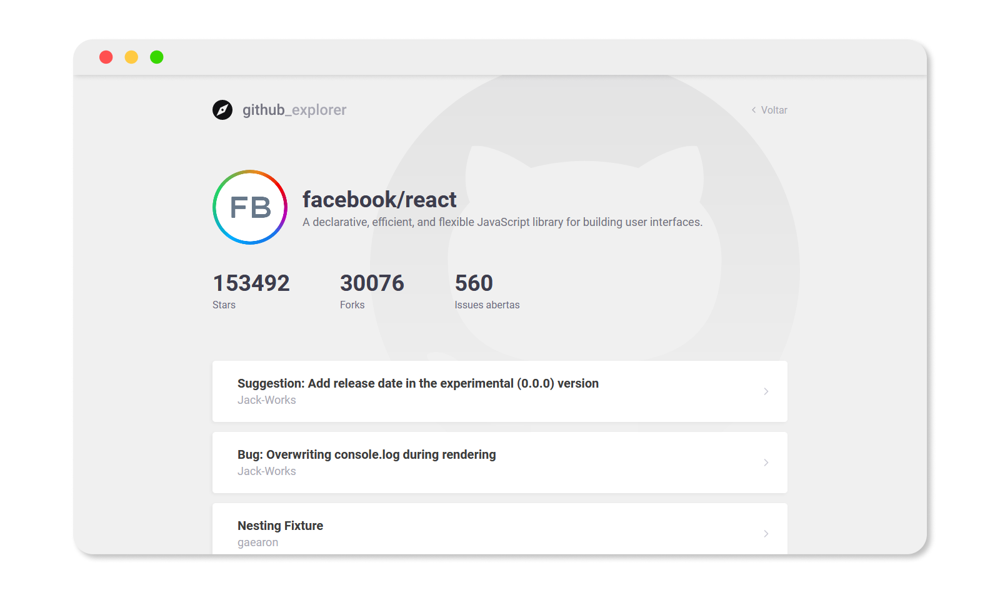

<p align="center">
 
</p>

<h3 align="center">GitHub Explorer</h3>

---

Aplicação desenvolvida durante o Bootcamp GoStack 11.0 da [Rocketseat](https://rocketseat.com.br/) para consumir a [API do GitHub](https://developer.github.com/v3/) trazendo informações sobre os repositórios.


## 📝 Conteúdo

- [Sobre](#about)
- [Funcionalidades](#tools)
- [Instalação](#install)
- [Tecnologias utilizadas](#built_using)
- [Autores](#authors)
- [Screenshots](#screenshots)

## 🧐 Sobre <a name = "about"></a>

A aplicação foi desenvolvida com o intuito de praticar o consumo de API's externas utilizando ReactJS. Nela consumimos a [API do GitHub](https://developer.github.com/v3/) onde o usuário pode adicionar um repositório que fica salvo no ``LocalStorage`` do navegador para poder consultar alguns detalhes.
<br /><br />

## 🔧 Funcionalidades <a name = "tools"></a>

- `Pesquisa de repositórios no GitHub`
- `Visualização de detalhes do repositório`

## 🏁 Instalação <a name = "install"></a>

Faça o download do projeto em .zip ou utilize git caso esteja instalado na máquina:
```
git clone https://github.com/agustinhopneto/github-explorer.git
```

Depois entre na pasta do projeto pelo terminal e execute:
```
npm install
```

Após isso é só iniciar a aplicação:
```
npm run start
```

### Pré-requisitos

Para rodar o projeto é importante que tenha o [Node.js](nodejs.org) instalado na sua versão mais recente ou maior que `12.18.1`.

## ⛏️ Feito utilizando <a name = "built_using"></a>

- [Nodejs](https://nodejs.org/en/)
- [ReactJS](https://pt-br.reactjs.org/)
- [Typescript](https://www.typescriptlang.org/)
- [EsLint](https://eslint.org/)
- [Prettier](https://prettier.io/)
- [Axios](https://github.com/axios/axios)
- [Styled Components](https://styled-components.com/)

## 💻 Screenshots <a name = "screenshots"></a>

<p align="center">
 
</p>
<p align="center">
 
</p>

## ✍️ Autores <a name = "authors"></a>

- [@agustinhopneto](https://linkedin.com/in/agustinhopneto)

